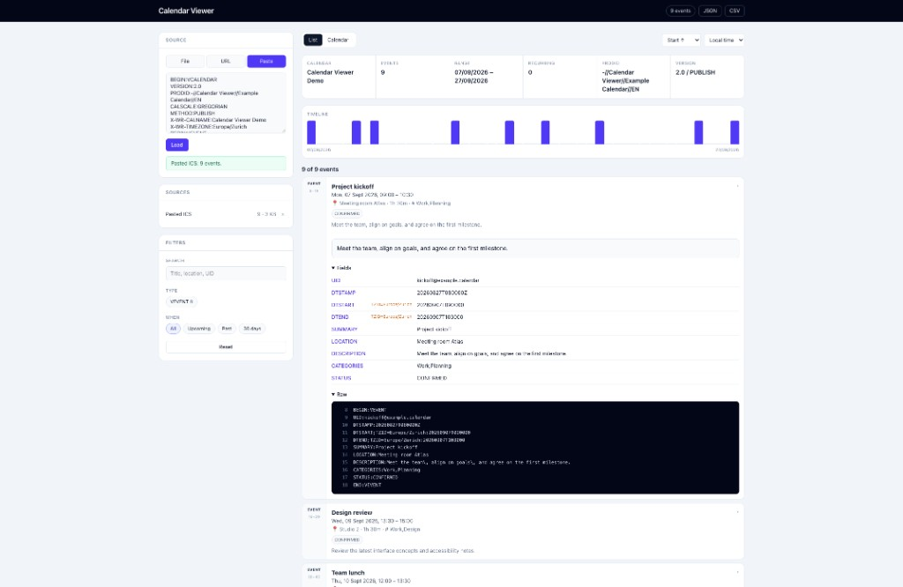
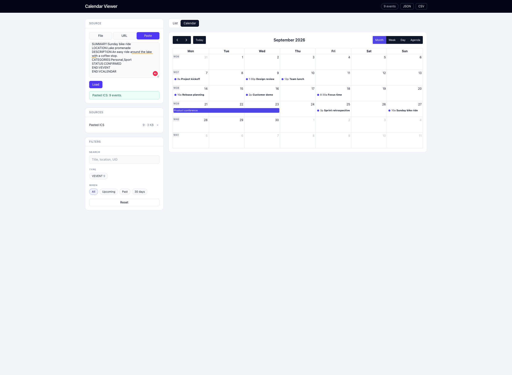

# Calendar Viewer

Open iCalendar (`.ics`) files, URLs, or pasted calendar data in calendar and
list views. Calendar data is parsed in the browser and is not stored or
imported.

### List view



### Calendar view



Try the interface with the included
[example calendar](examples/example-calendar.ics).

## Run with Docker

Prerequisites: Docker with Docker Compose.

```sh
docker compose up
```

Open <http://localhost:8787>. Compose pulls the public
`ghcr.io/okaufmann/calendar-viewer:latest` image.

After publishing the first release, the repository owner must make the GHCR
package public once in its package settings. GitHub does not provide an API to
automate this visibility change. The publish workflow verifies anonymous access
and reports the settings link until this one-time step is complete.

To pin a release, replace `latest` in `docker-compose.yml` with a version such
as `v1.0.0`.

Build the image from the local source instead:

```sh
docker compose up --build
```

Or run the published image without Compose:

```sh
docker run --rm -p 127.0.0.1:8787:8787 ghcr.io/okaufmann/calendar-viewer:latest
```

The container can access services running on the Docker host through
`host.docker.internal`. This is useful for calendars served by a local
development environment.

## Security

The `/fetch` endpoint loads remote calendar URLs for the browser. It can make
requests to arbitrary HTTP and HTTPS destinations, so the example Compose file
publishes the app only on `127.0.0.1`. Do not expose the container publicly
without restricting this proxy.

## Configuration

| Variable | Default in the image | Description |
| --- | --- | --- |
| `PORT` | `8787` | Port used by the Python server inside the container |
| `BIND` | `0.0.0.0` | Address used by the Python server inside the container |

If `PORT` changes, update the container side of the published port as well.

## Develop without Docker

Prerequisites: Node.js 24, pnpm 11, and Python 3.12.

Install dependencies and start the backend:

```sh
pnpm install
pnpm build
python3 app.py
```

The built app is available at <http://localhost:8787>.

For frontend development with hot reload, run the backend and Vite in separate
terminals:

```sh
python3 app.py
```

```sh
pnpm dev
```

Open <http://localhost:5173>. Vite proxies `/fetch` to the Python backend on
port `8787`.

## Release

Commit messages follow [Conventional Commits](https://www.conventionalcommits.org/).
To publish a release, create and push a semantic version tag:

```sh
git tag v1.0.0
git push origin v1.0.0
```

CI generates `CHANGELOG.md`, creates the matching GitHub Release, and publishes
both `ghcr.io/okaufmann/calendar-viewer:v1.0.0` and
`ghcr.io/okaufmann/calendar-viewer:latest`.

## License

Calendar Viewer is available under the [MIT License](LICENSE).

Local Herd, Valet, and other `*.test` / `*.localhost` URLs are fetched through `host.docker.internal`, so you can paste the same calendar URL you use in the browser. Loopback URLs (`http://localhost:8000/...`) are sent to the host as well. Override the target with `HOST_GATEWAY`, or add extra names with `LOCAL_HOSTS` / `LOCAL_HOST_SUFFIXES`.
